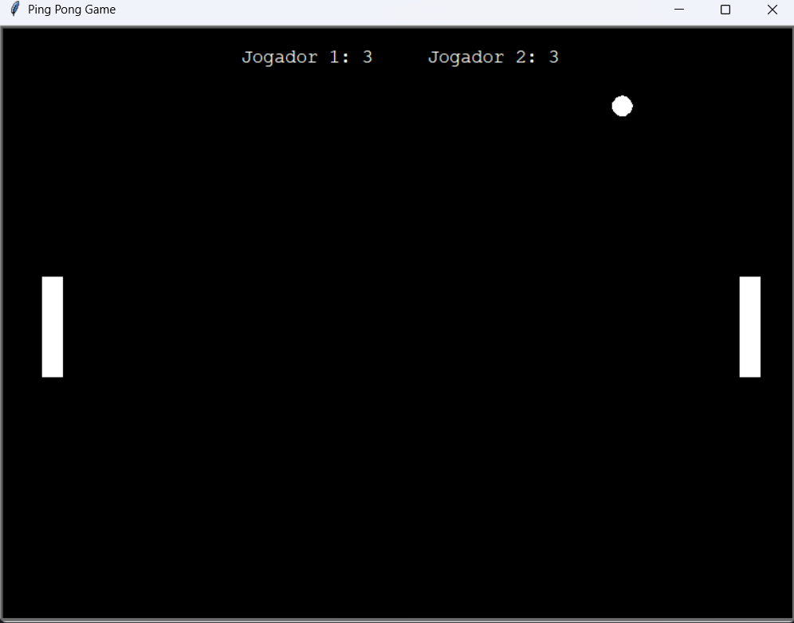

# Ping-Pong Game 🎮

Este é um jogo clássico de ping-pong desenvolvido em Python utilizando a biblioteca Turtle para criar a interface gráfica. O jogo é simples, mas divertido, e permite que dois jogadores controlem suas respectivas raquetes em um duelo de reflexos rápidos.

## Funcionalidades:
- 🎯 **Controles Simples**: Cada jogador controla uma raquete (esquerda/direita) para rebater a bola.
- 🏓 **Interface Gráfica**: Desenvolvido com Turtle, uma biblioteca leve e fácil de usar para gráficos 2D.
- 💻 **Multijogador Local**: Dois jogadores podem competir no mesmo teclado.
- ⚙️ **Pontuação**: O jogo mantém o controle da pontuação de ambos os jogadores.

## Como Jogar:
1. Clone o repositório para o seu computador.
2. Execute o arquivo `ping pong.py`.
3. Use as teclas para mover as raquetes:
   - Jogador 1: W (para cima) e S (para baixo).
   - Jogador 2: Up Arrow (↑) e Down Arrow (↓) para mover a raquete.

## Tecnologias Utilizadas:
- Python 🐍
- Turtle 🐢

## Instalação:
Certifique-se de ter Python instalado. Para instalar a biblioteca Turtle, use:
```bash
pip install PythonTurtle
```
## Captura de Tela do Jogo:

